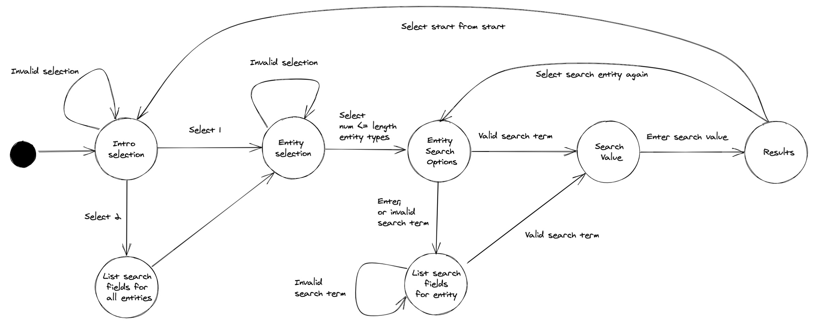

# Search CLI

This application is a simple command line application to search data and return
results in a readable format. The data relates to a ticket-tracking system,
where tickets correspond to an organization and user.

## Building the application

To build the application, use:

```
make build
```

This will build an executable called `search-cli` in the
`build/install/search-cli/bin` directory.

## Running the application

The `search-cli` executable can be run with:

```
make run
```

## Overview of application

This application is written in Kotlin and uses gradle as a build tool. The
entrypoint to the application (the `main` function) is in the
`src/main/kotlin/search/cli/App.kt` file.

## Requirements

- Search response times should not increase linearly as the number of documents
  grows
- The user should be able to search on any field
- The user should be able to search for empty values, e.g. where description is
  empty.
- Values from any related entities should be included in the results, i.e.
  searching organization by id should return its tickets and users.
- Only full value matching is allowed (e.g. "mar" won't return "mary").

## Assumptions

- The dataset can be feasibly stored in memory on a single machine
- The `_id` field of each entity is unique
- Entities are related as follows:
  - Each ticket must be associated with one organization
  - Organizations can have zero or more tickets
  - Each user must be associated with one organization
  - Organizations can have zero or more users
  - Tickets must be associated with one user through the `submitter_id`
  - Tickets may be associated with one user through the `assignee_id`
  - Tickets may be associated with one user through the `requester_id`

## Design Decisions

### Data structures

The requirement for sub-linear search time means that some data processing will
be required on application startup. Simply sorting the list of organizations,
users and tickets to allow for `log(n)` time is not a solution given that it is
a requirement to be able to search on any field. While it requires `O(n)`
processing on startup, indexing on each field for each data structure allows for
constant time searching.

### Application state machine

As an interactive CLI, there are various stages of the application with each
stage requiring different prompt text and permitting different user inputs. For
this reason, the application was modelled as a state machine. Each state
describes the prompt display and the permitted state transitions. The state
machine can be visualised as follows: 

### Extensibility

The data structures of Organizations, Users and Tickets are ones that may be
subject to change in the future. For example, new fields may be required or
fields may become obsolete. It is also possible that entirely new entity types
may need to be defined in future. Therefore, care has been taken to avoid
hardcoding properties of these data structures wherever possible.

## Testing

To run the unit tests, use:

```
make test
```

## TODO

- Index null and empty string fields
- Allow user to enter empty string for search value
- Index flattened fields (i.e. tags and domain names)
- Include `assignee_id` and `referrer_id` in the user-ticket relationship search
- Implement integration tests for the prompt
